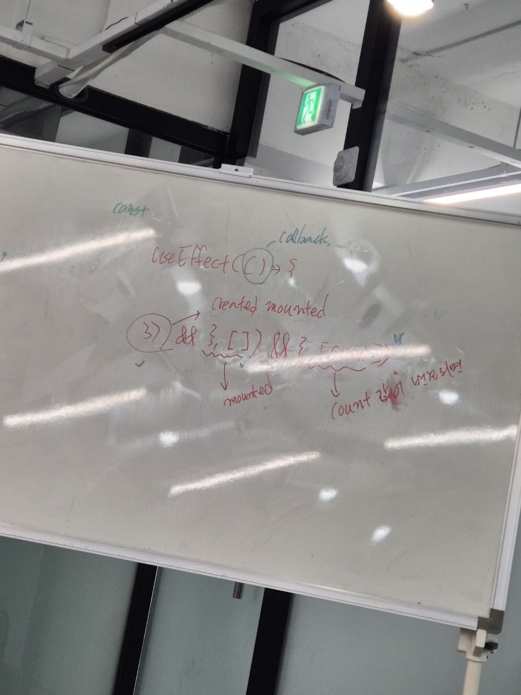

의존성 콜백함수


# 3가지 useEffect



# 🚀 useEffect란?

`useEffect`는 React에서 **컴포넌트가 화면에 나타날 때, 업데이트될 때, 사라질 때 실행해야 할 작업**을 처리하는 도구입니다.

### 🧐 언제 사용할까요?
- 화면이 처음 열릴 때 데이터를 가져와야 할 때 (API 호출)
- 화면이 바뀔 때마다 실행해야 할 코드가 있을 때
- 타이머를 설정하거나 정리해야 할 때

## 🛠️ 기본 문법
```jsx
import React, { useEffect } from 'react';

function MyComponent() {
  useEffect(() => {
    console.log('컴포넌트가 화면에 나타났어요!');

    return () => {
      console.log('컴포넌트가 화면에서 사라졌어요!');
    };
  }, []);

  return <div>안녕하세요!</div>;
}
```

## 📚 사용 사례

### 1️⃣ 화면이 처음 나타날 때만 실행
```jsx
useEffect(() => {
  console.log('한 번만 실행됩니다!');
}, []); // []는 처음 한 번만 실행하라는 뜻
```

### 2️⃣ 특정 값이 바뀔 때 실행
```jsx
useEffect(() => {
  console.log('count 값이 바뀌었어요!');
}, [count]); // count가 바뀔 때만 실행
```

### 3️⃣ 정리(cleanup)하기
```jsx
useEffect(() => {
  const timer = setInterval(() => {
    console.log('1초마다 실행됩니다.');
  }, 1000);

  return () => {
    clearInterval(timer); // 타이머 멈추기
  };
}, []);
```

## 🧠 의존성 배열이란?
- `[]` → 화면에 처음 나타날 때만 실행
- `[value]` → value가 바뀔 때만 실행
- 생략 → 화면이 바뀔 때마다 실행

## ⚠️ 주의사항
- 무한 반복 주의! 의존성 배열을 잘못 설정하면 계속 반복될 수 있어요.
- `async` 함수는 `useEffect` 안에서 바로 사용하지 말고, 함수 안에서 따로 선언하세요.

## 🎯 정리
- `useEffect`는 화면이 나타날 때, 업데이트될 때, 사라질 때 필요한 작업을 할 수 있습니다.
- 의존성 배열을 사용해 실행 조건을 정할 수 있습니다.
- 정리(cleanup) 함수를 사용해 타이머나 이벤트를 잘 관리하세요.

이제 `useEffect`로 React 컴포넌트를 더 쉽게 관리해보세요! 🌟
