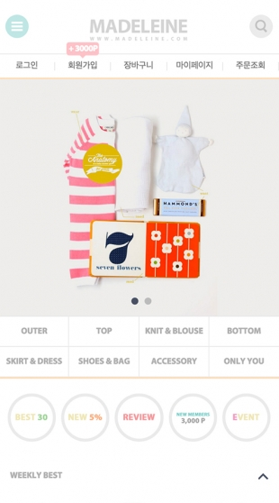

# 이미지맵
```
- shape : area 모양
          react : 직사각형
          circle : 원형
          poly : 다각형

사각형 모양일 때
coords="x1,y1,x2,y2" : 좌, 상, 우, 하

원형일 때
coords="x,y,radius" : 원형 중앙과 반지름의 좌표

다각형일 때
coords="x1,y1,x2,y2,...xn,yn" : 다각형 끝의 좌표

 target : 링크를 여는 형태
_blank : 새 창으로 열림
_parent : 부모 창에 열림
_self : 현재 페이지에서 열림
_top : 전체 브라우저 창에서 열림

2. 이미지맵 좌표값 쉽게 찾기 사이트
maschek.hu - Online Image Map Editor
```

```html
    <div class="wrap">
        
        
        <map name="event1" id="event1">
            <!-- <area shape="rect" coords="좌측 상단 x1 y1 우측하단 x1 y2" href="#" alt=""> -->
            <area shape="rect" coords="339,406,460,437" href="#" alt="">
        </map>
        
        <map name="event2" id="event2">
            <!-- <area shape="rect" coords="좌측 상단 x1 y1 우측하단 x1 y2" href="#" alt=""> -->
            <area shape="rect" coords="339,406,460,437" href="#" alt="">
            <area shape="rect" coords="466,327,590,360" href="#" alt="">
        </map>
    </div>
    <hr>
    
    <map name="shop" id="shop">
        <!-- <area shape="circle" coords="원의 중심 좌표 x y 반지름 r" href="#" alt=""> -->
        <area shape="circle" coords="19,28, 13" href="#" alt="">
        <area shape="circle" coords="289,28, 13" href="#" alt="">
        <!-- <area shape="poly" coords="꼭지점 x1,y1 x2y2 x3y3" href="#" alt=""> --> 
        <area shape="poly" coords="72,46, 108,47 ,111,62 94,62 ,92,65,88,62,72,62" href="#" alt="">
    </map>
```
# 태그
```html
   <h1 style="font-size: 16px; font-style: italic;">작성자 주소</h1>
   <address>
        대전시 중구 선화동<br>
        연락처 : 042-252-1154
   </address>
   <p>
       <small>
           <!-- copyright &copy; 2024 cezanne. All right reserved<br> :X 잘못된 표기 -->
        copyright 2024 cezanne. All right reserved<br>
        copyright &copy; 2024 cezanne. All right reserved
       </small>
   </p>
```